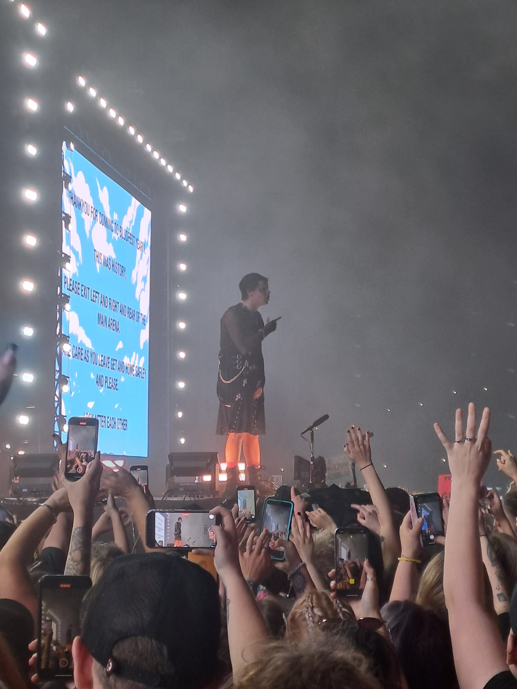
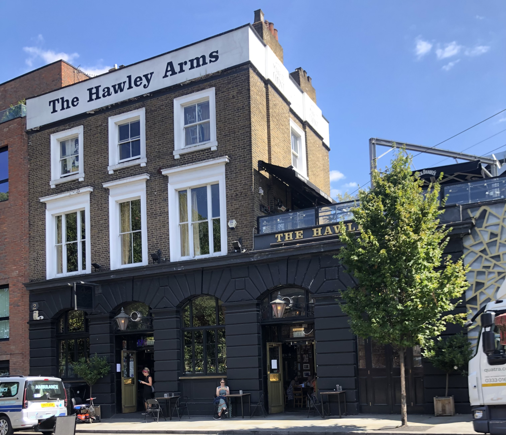

[Passer en anglais](../en/secondpage.md)# Ses autres projets 
## Bludfest 

Dom a créé son propre festival appelé "Bludfest" pour la première fois cette année.  
===

Il a eu lieu le 11 août au Milton Keynes Bowl, (plus précisément dans le Buckinghamshire) en Angleterre. Il souhaitait que le prix des billets soit le plus bas possible, car beaucoup de gens n'ont pas les moyens de payer des billets pour les festivals (ils sont généralement très chers). Il a déclaré dans une interview à ce sujet que la musique s'adressait à tout le monde et qu'il souhaitait donc que le plus grand nombre possible de personnes puissent assister à l'événement. Les billets coûtaient £49.50 et plus de 7 artistes ont joué au festival, dont Lola Young, Noahfinnce, The Damned (ce groupe était l'icône de l'événement), Jasmin Bean et Lil Yatchy.  

Il y avait aussi d'autres choses à faire, comme des endroits où l'on pouvait acheter des marchandises ou même des vêtements de marque, de la marque qu'il a créée, appelée BRAT (qui signifie Beautifully Romanticised Accidentally Traumatized). Il y avait différents types de nourriture à choisir (vous pouviez manger chez Nando's et obtenir un hamburger de Yungblud :) ou même boire de la Bludbeer !)   
>Un pub a également été construit sur les lieux : le Hawley Arms.  
>
>> Ce pub est en fait situé à Camden Town (à Londres).
>
>P.S : c'est le pub préféré de Dom et c'est celui où Amy Winehouse avait l'habitude d'aller !

  

Au festival, il y avait également une tente "Make a Friend Tent", qui était idéale si vous aviez besoin d'un endroit pour vous détendre. C'était aussi un endroit où l'on pouvait se faire des amis si l'on était inquiet à l'idée d'aller seul à Bludfest. (Il y avait un petit jardin derrière la tente où l'on pouvait se détendre, c'est là que mon ami et moi avons noué des liens d'amitié avec d'autres fans).  

Si vous souhaitez en savoir plus sur sa vie et son œuvre, suivez ce lien : [Backtomainpage](FR/index.md). Si vous voulez en savoir plus sur le festival, voici un lien vers un excellent article que j'ai lu il y a quelques semaines : [GigGuidearticle](https://www.gig-guide.co.uk/news/bludfest-review?fbclid=PAZXh0bgNhZW0CMTEAAabhbA8UNiRBSsi8YgTFejUkihuB9MRpnm4itVr4U9ryFyd77HFrYWtl6f8_aem_56a0Afq1yBh1ucfO4BsPwQ).

Milton Keynes Bowl | Nombre de personnes ------------- | ------------- Capacité | 30 000 personnes Artistes ayant joué au festival | 12 (dont Yungblud)  

Il y avait une "exposition Yungblud" où l'on pouvait voir différents objets datant de l'époque où Dom était en tournée (comme sa guitare ou ses précédents albums). De plus, à la fin de l'exposition, vous pouvez écrire un secret ou une confession sur les murs. Ensuite, vous avez reçu un pin's gratuit avec un petit fantôme jouant de la guitare. Vous pouvez également acheter le livre qu'il a écrit, intitulé "You need to exist, a book to love and destroy" (Vous devez exister, un livre à aimer et à détruire) et obtenir un marque-page gratuit. Plus d'informations sur le livre via ce lien : [Livre](./thirdpage.md).  
