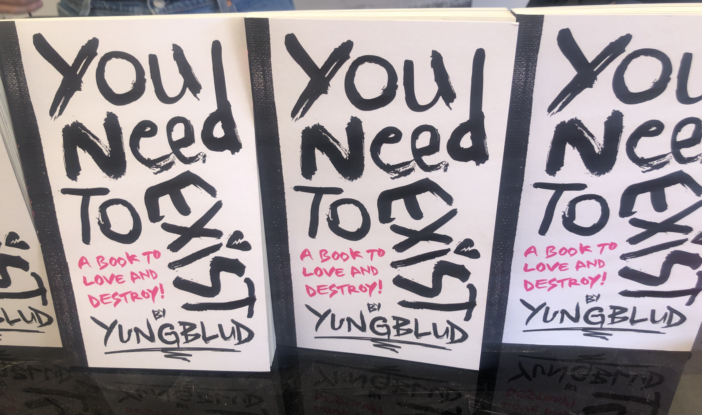

# His other projects 
## "You need to exist, a book to love and destroy! by YUNGBLUD" 
  
 `picture of the book with title on the cover`  

Dom wrote a book which was published on the 13th of August, this year. (You could also buy it at his own music festival which took place two days prior. More info via this link: [Bludfest](dossier/secondpage.md)

This book is a way to, face your fears and insecurities or to have a place in which you can find comfort, have an outlet. It's also a way to help you discover who you are. In this book, each page has a different layout and has a specific use.  
==================================================================== 

For example there's: 
* a page where you are asked to write all of your regrets (then burn the page) and there's another page on which you are suppposed to write things that bring you joy
* a page on which you can write your insecurities and another one on which you can write things you like about yourself
* a page on which he describes heartbreak
* a page on which he explains to trust your instinct and that you shouldn't let other people's opinions' influence you
* a page on which there are drawing of someone's lips and evey time you speak up, you can sew them and cut them out of the book
* a page where you can write something for your youngerself and for you in the future  

The particularity of this book, apart from the fact that every page has a different message and objective, the author (Dom) answers the questions as well; so it's as if you are taking turns and going through this book with him.  

In other words, this book is a kind of diary that can resonate with the reader and it can also be a place to find solace, acceptance and support. 

