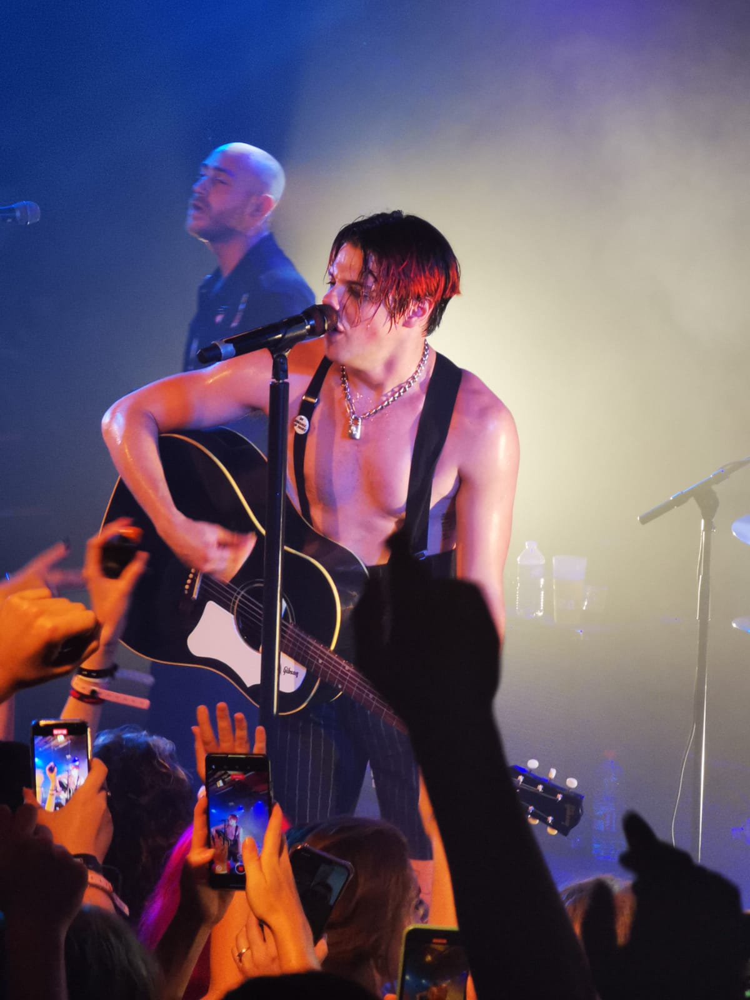

# YUNGBLUD

## Biography 
### Basics
Dominic Richard Harrison (stagename Yungblud) is an English artist (more specifically a singer and a songwriter). He was born in Doncaster, which is a city located in the North of England, more specificallly in South Yorkshire. 
He was born on the 5th of August 1997.
His songs don't really fit a box in terms of music genres. He released different types of songs that could be labelled as pop, rock, hip hop or punk songs. His work is inspried from different singers that make different types of songs. For example, he got his inspiration from My Chemical Romance, the Clash, the Cure, the Sex Pistols, Lady Gaga or even Eminem.
His music gathered so many people together, his work enabled people to find a community where they can be themselves without judgment, which is called the BHC (the black hearts club).  

#### His family/childhood
His mum (Samantha Harrison) own a café and his dad (Justin Harrison) own a record shop. He has two younger sisters (named Isobel and Jemima). 
He was diagnosed with ADHD from a very young age. It stands for Attention Hyperactivity Deficit Disorder. He explained in an interview with Louis Theroux that it was a source of energy and that it was why he hadn't slept well enough in years. He also explained that at school, he had difficulties concentrating on any task. He also had mood swings which were elemments that led to him getting his diagnosis. He addressed this topic in more details in an extract from the said interview, accessible via the following link: [The interview with Louis Theroux]( https://www.youtube.com/watch?v=UG_imPDsxfw).  

He moved to London when he was about 16, 17 years old. He was hoping that he would "find himself" there because gowing up in Doncaster, he explained that he was judged and mocked for the was he expressed himself, for being opinionated, outspoken  and for the was he dressed. During his time in London, he was studying at the Art Educational School. At some point, he was sharing a flat with, his best friend, and now guitar player, Adam .... They dicussed different anecdotes about that period of time in a podcast he made called "The YUNGBLUD Podcast", accessible via this link for more info: [The YUNGBLUD Podcast](https://www.bbc.co.uk/sounds/play/m000p82j).  

### His discography

The first song he ever released is "King Charles" and it was released in 2017. He then released "Tin Pan Boy" to denounce a construction project in London. In 2018, he released his first album called "21st Century Liability" which raised awareness on a variety of topics such as sexual assault, gun violence, and mental health. He then released an EP called "Hope for the Underrated Youth", with a song called "Parents" denouncing homophobia amongst other things.  

In 2020, he released a new album called "Weird!". He worked on the album during lockdown and released songs with a different universe for each of them such as: 
* cotton candy
* strawberry lipstick
* weird!
* mars
* superdeadfriends

Link to the page about his book: [Book](dossier/thirdpage.md)  
Link to the page about his music festival: [Bludfest](dossier/secondpage.md)
